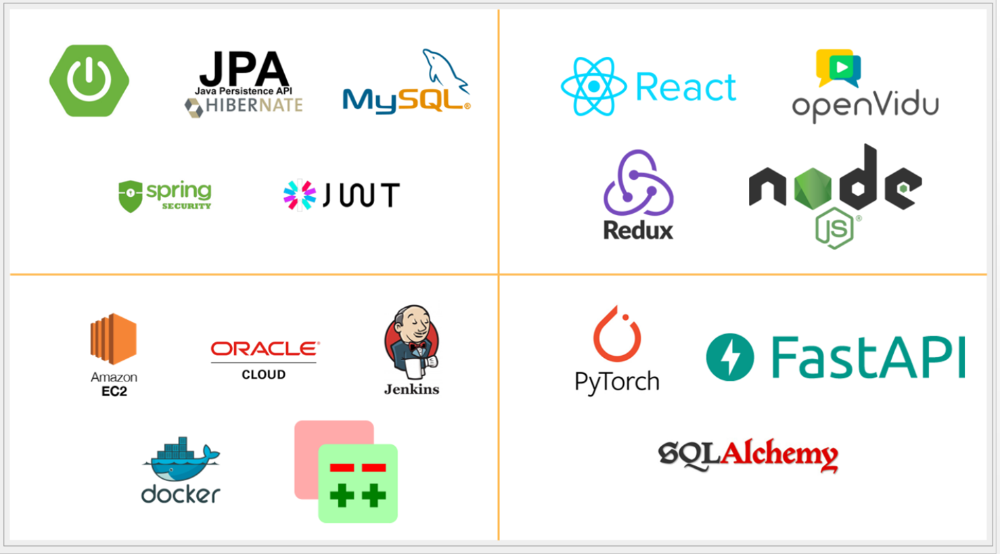
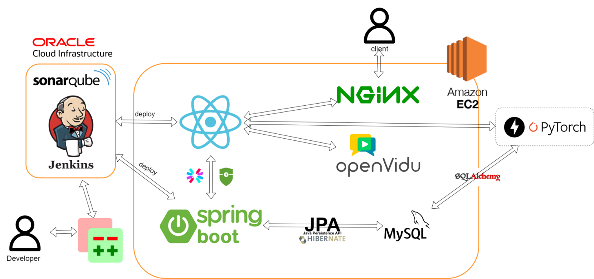
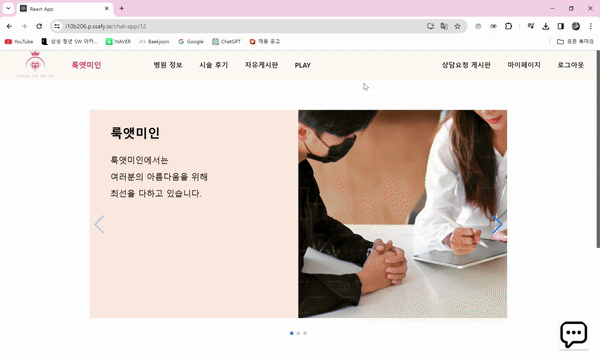
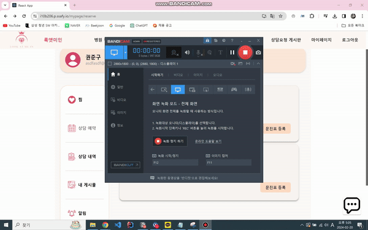
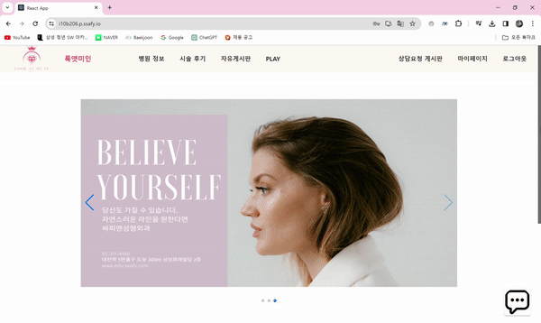
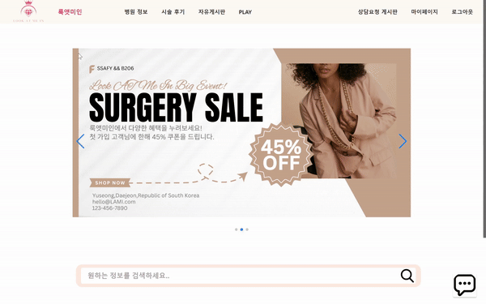
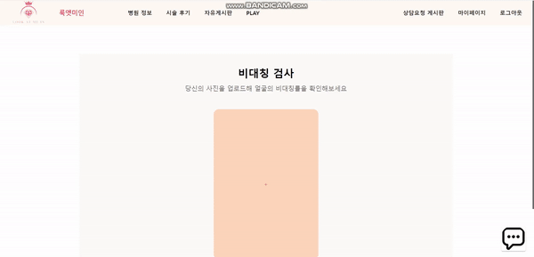
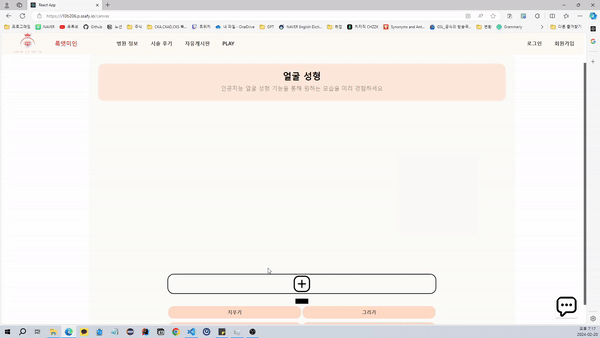

# Read.me

## 💡 서비스 소개

---

## 손쉽게 상담부터 예약까지, 내 손 안에 성형서비스

> 성형 상담을 위해 병원에 직접 방문하는 것은 시간과 노력이 많이 드는 일입니다.
그래서 저희는 집에서 편안하게 비대면으로 성형 상담을 받고, 원하는 병원을 예약할 수 있는 
웹서비스를 만들었습니다.
이제 직접 병원에 가지 않아도, 화상통화를 통해 전문적인 상담을 받고, 바로 예약까지 할 수 있습니다.
> 

## 🔎 프로젝트 개요

---

### 🤔 이런 사람들을 위해 만들었어요

- 성형이 하고 싶지만 상담을 받기 위해 시간을 투자하기 어려운 사람
- 혼자서 상담 받으러 가기 부담스러운 사람
- 솔직한 후기를 통해 내가 원하는 병원을 선택하고 싶은 사람

### 🗓️ 개발 기간 : 2024.01.08 - 2024.02.16 (6주)

## 🛠️ 기술스택

---

## ⚙️ 아키텍처

---

### 버전 정보

- Spring : 3.2.1 (gradle 8.5)
- Java 17
- JPA : 6.4.2
- MySQL - 8.0.36
- Python : 3.11
- nginx: 1.25.3

## 📕 주요기능 및 데모영상

---

- **찜하기 버튼을 통한 병원 즐겨찾기 등록** : 병원 상세 페이지에서 찜하기 하트 버튼을 통해 마이페이지에서 즐겨찾는 병원을 조회할 수 있습니다.
    
    
    
- **채팅을 통한 상담** : webRTC를 통한 채팅 기능으로 병원과 직접 대화를 할 수 있으며, 화상 상담 예약도 실시간으로 잡을 수 있습니다.
    
    
    
- **비대면 성형 상담** : RTC 화상 상담 기능을 통해 어디서든 전문가와 상담할 수 있습니다. 집에서도, 카페에서도 상담이 가능합니다.
    
    
    
- **성형 요청 기능** : 내가 글을 작성하면 병원에서 상담을 요청할 수 있습니다. 내가 작성한 글에 병원이 응답한다면 마이페이지에서 요청을 보내온 병원 목록을 조회할 수 있습니다.
    
    
    
- **편리한 병원 예약** : 상담을 마친 후, 마음에 드는 병원을 바로 예약할 수 있습니다. 복잡한 절차 없이 몇 번의 클릭으로 예약 완료!
    
    
    
- **수술 후기 모음** : 수술을 경험한 사람들만이 작성할 수 있는 진솔한 후기를 확인할 수 있습니다.
    
    
    

- **얼굴 비대칭 검사** : 사진을 업로드 하면 얼굴 비대칭 검사를 통해 얼마나 대칭이 맞는지 알려드립니다.
    
    
    
- **얼굴 성형 기능** : 룩엣미인에서 제공하는 가상 성형 기능을 통해 성형결과를 예측해 볼 수 있습니다.
    
    
    

## 👨‍👩‍👧‍👧 개발멤버 소개

---

심규리 : B206 팀장을 맡은 심규리입니다. 저는 프론트엔드와 프로젝트 계획과 일정관리를  담당했습니다. 믿고 따라와 팀원들 때문에 행복한 프로젝트를 했습니다.

박지운 : 프론트 리더를 담당한 박지운입니다. 저는 프론트 엔드 전반적인 git관리와 RTC 구현을 담당했습니다. 팀의 기둥이 되겠습니다.

오건영 : 프론트엔드 오건영입니다. 저는 웹소켓을 이용한 채팅과 전체적인 웹디자인을 담당했습니다. 결국엔 제가 다 이깁니다

권준구 : 백엔드를 담당한 권준구입니다. 저는 DB설계를 맡아서 진행했습니다. 성능최적화에 힘 쓰겠습니다.

김희수 : 백엔드 리더를 담당한 김희수입니다. 저는 인프라와 성형 인공지능을 담당했습니다. 

박하윤 : 백엔드를 담당한 박하윤입니다. 로그인/회원가입 담당했습니다. 유저 정보 보안을 위해 힘을 썼습니다.
